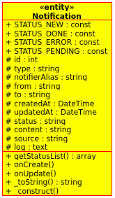
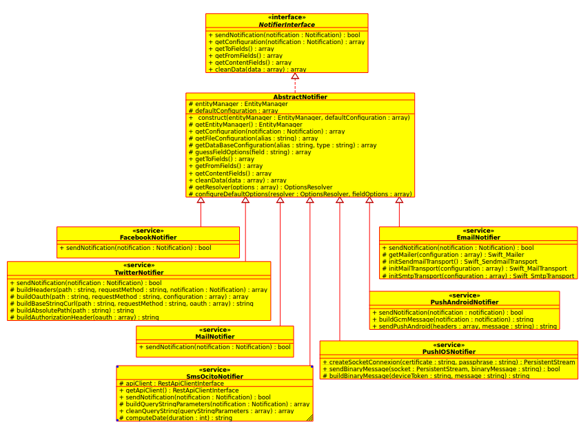

IDCINotificationBundle Notification Service
===========================================


Notification
------------
### What is a Notification ?
A notification is an persisted object called "entity" (using Doctrine). It is used to inform a user about a subject.

Object Notification :




#### What is the role of a notifierAlias ?

A notifierAlias is a string attribut of the entity Notification. This field identify which configuration has to be used to send a notification. Primery the notifierAlias is used to find a configuration in the database. Secondly, if there is no configuration in there then it is used to check in `app/config/config.yml` file.

Example : a configuration identified by an alias in a database

| Id | Alias    | Type  | Configuration
|----|----------|-------|-----------------------------------------------------------------------------------
| 1  | myalias1 | email | {"transport": "smtp","server": "smtp.test.com","login": "toto@test.fr","password": "test","port": 587,"encryption": "tls"}
Note 1 : valides types : email, sms, mail, facebook, twitter
Note 2 : the couple value {alias, type} is used to define the unique constraint in your database.

Example : a configuration identified by an alias in `app/config/config.yml`.
Please check : [Several_configurations_for_each_type_of_notifier](configuration_reference.md#several-configurations-for-each-type-of-notifier)

### How to create a Notification ?
There are 3 methods to create an notification.

####Method 1 : Use a web service.

| Type   | Path                                                     | Description
|--------|----------------------------------------------------------|------------------------
| POST   | [/notifications](api/notification/post_notifications.md) | Create an notification

####Method 2 : Create an interface to manage a notification (CRUD)

####Method 3 : Using [IDCINotificationApiClientBundle](https://github.com/IDCI-Consulting/NotificationApiClientBundle.git).
Exemple : Using the command line `tms:notification:notify` to create an email notification.
```sh
$ php app/console tms:notification:notify email '{"notifierAlias": "alias", "to": "me@mymail.com", "cc": "cc1@mymail.com, cc2@mymail.com", "bcc": "bcc@mymail.com", "subject": "notification via command line", "message": "the message to be send", "htmlMessage": "<h1>Titre</h1><p>Message</p>", "attachments": []}'
```
Note : This command line uses the web service of IDCINotificationBundle to create a notification.

### How to send a Notification ?
To send a Notification you can use this command line : `idci:notification:send`
```sh
$ php app/console idci:notification:send
```
Workflow of this command :

1. Find all notifications with "NEW" status.
2. Guess the notifier for each type of notification to send.
3. Send them one by one.

Notifier
--------
### What is a Notifier ?
A notifier is an object. It is used to send a notification.
There are five notifier types.

| Type     | Notifier         | development state
|----------|------------------|-------------------
| email    | emailNotifier    | 100%
| sms      | smsNotifier      | 10%
| mail     | mailNotifier     | 10%
| facebook | facebookNotifier | 10%
| twitter  | twitterNotifier  | 10%
| push_ios | PushIOSNotifier  | 100%

Notifier UML schema:



### How to create a Notifier
If you wish to add your own notifier, create a class which extends `IDCI\Bundle\NotificationBundle\Notifier\AbstractNotifier`
```php
<?php

namespace IDCI\Bundle\NotificationBundle\Notifier;

use IDCI\Bundle\NotificationBundle\Entity\Notification;

class MyNotifier extends AbstractNotifier
{
    /**
     * {@inheritdoc}
     */
    public function sendNotification(Notification $notification)
    {
        // Here the code to send your notification
    }

    /**
     * {@inheritdoc}
     */
    public function getToFields()
    {
        // To add custom fields store in to
        return array(
            'toField1'  => array('text', array('required' => true)),
            'toField2'  => array('text', array('required' => false)),
            //...
        );
    }

    /**
     * {@inheritdoc}
     */
    public function getContentFields()
    {
        // To add custom fields store in content
        return array(
            'contentField1'  => array('text', array('required' => false)),
            'contentField2'  => array('text', array('required' => false)),
            //...
        );
    }

    /**
     * {@inheritdoc}
     */
    public function getFromFields()
    {
        // To add custom fields store in from
        return array(
            'fromField1'  => array('text', array('required' => false)),
            'fromField2'  => array('text', array('required' => true)),
            //...
        );
    }
}
```
Detail : the values in array are used to create form field
```
'field'  => array('text', array('required' => false))
```
'field'    : field name
'text'     : [built-in field type](http://symfony.com/doc/current/book/forms.html#built-in-field-types)
'required' : field type options ([required option](http://symfony.com/doc/current/book/forms.html#field-type-options))

Now declare your notifier as service:
```yml
idci_notification.notifier.mynotifier:
    class: IDCI\Bundle\NotificationBundle\Notifier\MyNotifier
    arguments: []
    tags:
        - { name: idci_notification.notifier, alias: my_notifier }
```
